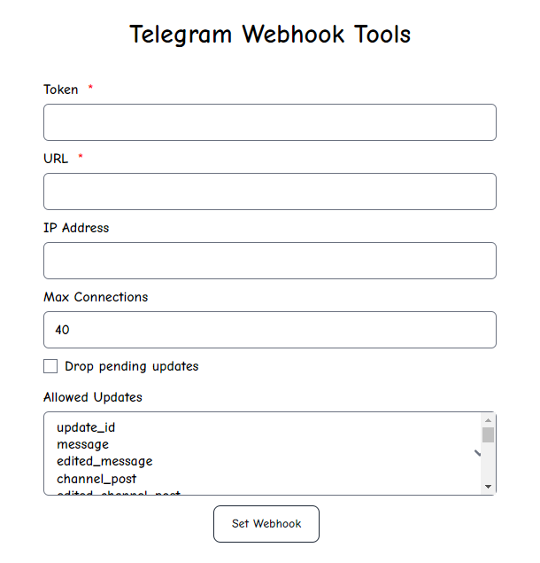

# Telegram Bot Webhook Tool Website

This website is a tool for setting up webhooks for Telegram bots.

It simplifies the process by providing a user-friendly interface to configure various parameters required for webhook integration.

## Preview

## Technologies Used

- This website utilizes:
  - Tailwind CSS for styling.
  - PHP for server-side scripting.
  - SweetAlert (Swal) for interactive dialogs.

## Tool Setup

1. **Get Telegram Bot Token:**
   Before using this tool, you need to obtain the token for your Telegram bot, which can be obtained from `@botfather`.

2. **Provide Webhook URL:**
   Enter the webhook URL, which must start with `HTTPS`.

3. **Optional: Server IP Address:**
   You may optionally provide the IP address of the server.

4. **Set Max Connections:**
   Specify the maximum number of connections, which can be a number between `40` to `100`.

5. **Enable Drop Pending Updates:**
   You have the option to enable dropping pending updates by ticking the "`drop pending updates`" checkbox.

6. **Select Required Updates:**
   Choose the updates that your bot needs to receive. If no option is selected, the default Telegram behavior will be applied.

This tool facilitates setting up a webhook for Telegram bots with various customizable options.

## Contribution

If you would like to contribute to the enhancement and improvement of this project, please send a pull request. You can also report issues through the issue tracker.

## Contact

<a href="https://t.me/LampStack">Telegram</a> 
<a href="mailto:xialop@outlook.com">Email</a>

## License

This project is released under the [MIT License](LICENSE).
